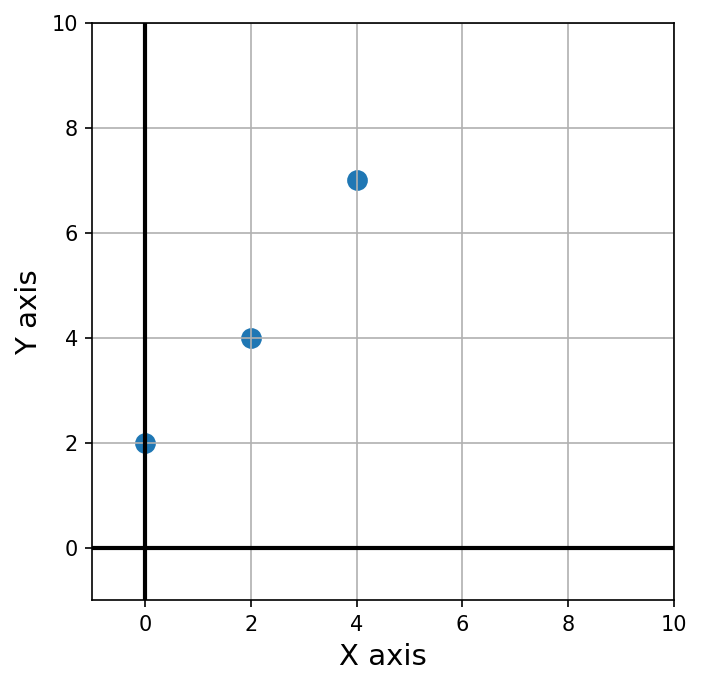

# linsolve

[](https://travis-ci.org/HERA-Team/linsolve)
[](https://coveralls.io/github/HERA-Team/linsolve?branch=master)

`linsolve` is a module providing high-level tools for linearizing and solving systems of equations.

# Overview

The solvers in `linsolve` include `LinearSolver`, `LogProductSolver`, and `LinProductSolver`.
`LinearSolver` solves linear equations of the form `'a*x + b*y + c*z'`.
`LogProductSolver` uses logrithms to linearize equations of the form `'x*y*z'`.
`LinProductSolver` uses symbolic Taylor expansion to linearize equations of the
form `'x*y + y*z'`.

See [linsolve_example.ipynb](linsolve_example.ipynb) for a tutorial on how to use these functionalities.

---

Below we give a brief example on the general usage of `LinearSolver`.

Assume we have a linear system of equations, with a data vector `y` containing measurements
and a model vector `b` containing parameters we would like to solve for. Let's simplify to 
the problem of fitting a line to three data points, which amounts to solving for a slope and an offset.
In this case, our linear system of equations can be written as


where `b_1` is the slope and `b_2` is the offset, and the `A` matrix contains the mapping
from model vector `b` to data vector `y`. In our case, the `a_x1` values are the x-values of the data points, and the `a_x2` values are equal to unity. Let's assume the data vector measurements are `y_1 = 2`, `y_2 = 4` and `y_3 = 7`, and their corresponding dependent variable values are `a_11 = 0`, `a_21 = 2` and `a_31 = 4`.



We will use `LinearSolver` to solve this system of equations in the following manner.
First we setup a data dictionary, which contains as keys strings of the RHS of our linear model equation,
and as values the y-data measurements:

```python
data = {'b_2': 2.0, '2.0*b_1 + b_2': 4.0, '4*b_1 + b_2': 7.0}
```

Alternatively, we can write the data dictionary more generally by also writing dictionary of constants we don't want to solve for (i.e. the values of the `A` matrix):

```python
data = {'a_11*b_1 + a_12*b_2': 2.0, 'a_21*b_1 + a_22*b_2': 4.0, 'a_31*b_1 + a_32*b_2': 7.0}
consts = {'a_11': 0.0, 'a_21': 2.0, 'a_31': 4.0, 'a_12': 1.0, 'a_22': 1.0, 'a_32': 1.0}
```

We then feed this into `linsolve.LinearSolver` (optionally passing the `consts` dictionary as keyword arguments.)

```python
ls = linsolve.LinearSolver(data) # or linsolve.LinearSolver(data, **consts) if we use constants
solution = ls.solve()
```

The output, `solution`, is a dictionary with solution of our model vector:

```python
{'b_1': 1.2499999999999998, 'b_2': 1.8333333333333324}
```

Weighting of measurements can be implemented through an optional wgts
dictionary that parallels the construction of data. To see a more in-depth example,
please consult the [linsolve_example.ipynb](linsolve_example.ipynb) tutorial.

---

# Package Details
## Known Issues and Planned Improvements

For details see the [issue log](https://github.com/HERA-Team/linsolve/issues).

## Community Guidelines
Contributions to this package to add new file formats or address any of the
issues in the [issue log](https://github.com/HERA-Team/linsolve/issues) are very welcome.
Please submit improvements as pull requests against the repo after verifying that
the existing tests pass and any new code is well covered by unit tests.

Bug reports or feature requests are also very welcome, please add them to the
issue log after verifying that the issue does not already exist.
Comments on existing issues are also welcome.

# Installation
## Dependencies
First install dependencies. 

* numpy >= 1.10
* scipy

## Install linsolve
Clone the repository using
```git clone https://github.com/HERA-Team/linsolve.git```

Navigate into the directory and run ```python setup.py install```.
Note that this will automatically install any missing dependencies. If you use anaconda or another package manager you might prefer to first install the dependencies as described above.

## Tests
From the source linsolve directory run ```python tests/linsolve_test.py```.

